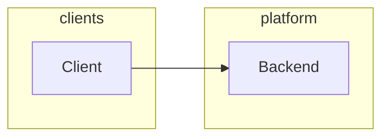

# Architecture overview

> Template — `solution-architect` baseline mode. Replace placeholders.

## Context

- **Product:** …
- **Factory profile:** …
- **Entry:** …

## Goals (non-functional)

See `quality-attributes.md`.

## System context

## Modules

| Module | Responsibility | Surfaces |
|--------|----------------|----------|
| … | … | `surface.id` |

## Key decisions

| ID | Summary | ADR |
|----|---------|-----|
| … | … | `decisions/ADR-001-….md` |

## Out of scope (architecture v1)

- …
